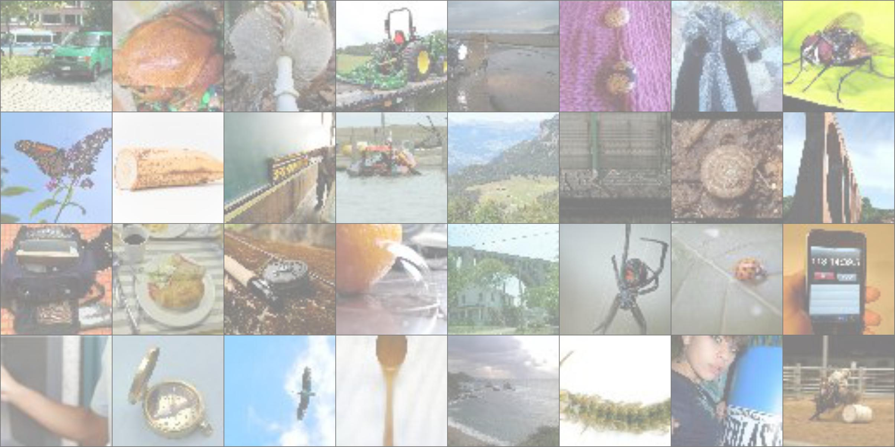

# stability-training
This repository contains a re-implementation of the code and results in the paper: Improving the Robustness of Deep Neural Networks via Stability Training by Stephan Zheng, Yang Song, Thomas Leung and Ian Goodfellow. 
# Dataset
We train and evaluate on the Tiny Imagenet dataset
<p align="center">
  

   
# Citation
``` bibtex
@article{DBLP:journals/corr/ZhengSLG16,
  author    = {Stephan Zheng and
               Yang Song and
               Thomas Leung and
               Ian J. Goodfellow},
  title     = {Improving the Robustness of Deep Neural Networks via Stability Training},
  journal   = {CoRR},
  volume    = {abs/1604.04326},
  year      = {2016},
  url       = {http://arxiv.org/abs/1604.04326},
  eprinttype = {arXiv},
  eprint    = {1604.04326},
  timestamp = {Tue, 08 Sep 2020 16:29:29 +0200},
  biburl    = {https://dblp.org/rec/journals/corr/ZhengSLG16.bib},
  bibsource = {dblp computer science bibliography, https://dblp.org}
}
``` 
